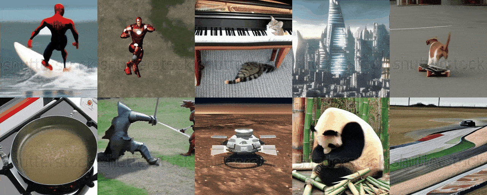
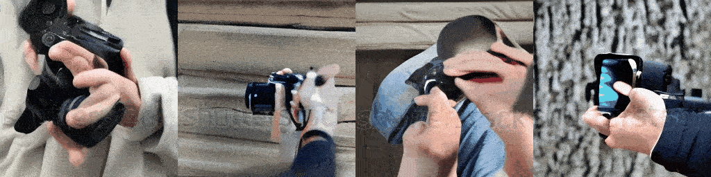
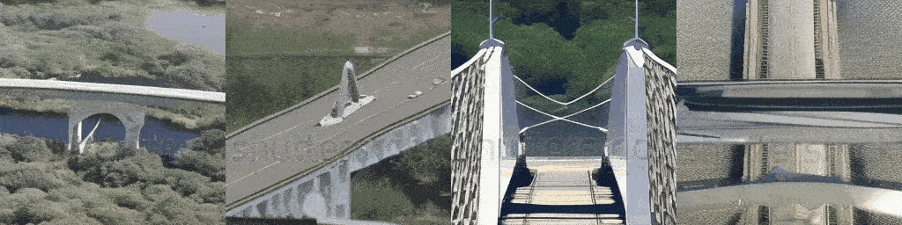
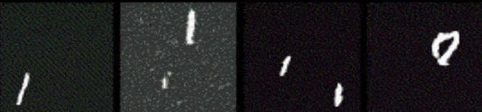
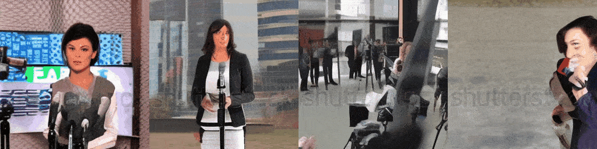

<div align="center">

<!-- omit in toc -->
# Text2Video from Scratch
  
   

</div>

This repository shows the step-by-step implementation of a **Text2Video** model from scratch using PyTorch. The model generates videos from text prompts using a diffusion-based architecture with a 3D U-Net and attention mechanisms.

Following are some results of the model trained on a (non commercial) shutterstock and (open source) msrvtt dataset for 10k Training steps, trained on a single GPU for 4 days:

Prompt: **A person holding camera - 10K Training Steps**



Prompt: **Spaceship crossing the bridge - 10K Training Steps**



Output of model trained on **moving mnist dataset** for **5K Training Steps**:



Prompt: **News reporter talking - 10K Training Steps**




<!-- omit in toc -->
## Table of Contents
- [Code Structure](#code-structure)
- [Step by Step Implementation](#step-by-step-implementation)
  - [Prerequisites](#prerequisites)
  - [Installing Module](#installing-module)
  - [Importing Libraries](#importing-libraries)
  - [Preparing the Training Data](#preparing-the-training-data)
  - [Defining Helper Functions](#defining-helper-functions)
  - [Attention Head](#attention-head)
  - [Building Blocks](#building-blocks)
  - [Common Components](#common-components)
  - [Relative Position Bias](#relative-position-bias)
  - [UNet3D Block](#unet3d-block)
  - [Coding Utils](#coding-utils)
  - [Dataset Transformation](#dataset-transformation)
  - [Gaussian Diffusion](#gaussian-diffusion)
  - [Text Handler (BERT Model)](#text-handler-bert-model)
  - [Trainer](#trainer)
  - [Configs](#configs)
  - [Model instantiation and Training](#model-instantiation-and-training)
  - [Generating Videos](#generating-videos)
- [Usage](#usage)
- [References](#references)
- [Contributing](#contributing)

## Code Structure

The codebase is organized as follows:
```bash
text2video-from-scratch/
├── configs/
│   └── default.yaml          # Configuration file for training parameters and hyperparameters
├── src/
│   ├── architecture/
│   │   ├── __init__.py       # Makes the architecture directory a Python package
│   │   ├── attention.py      # Contains the Attention and EinopsToAndFrom classes for attention mechanisms
│   │   ├── blocks.py         # Contains Block, ResnetBlock, and SpatialLinearAttention classes (building blocks for the UNet)
│   │   ├── common.py         # Contains common layers and utilities used in the architecture
│   │   ├── unet.py           # Contains the main Unet3D model definition
│   │   └── relative_position_bias.py   # Contains the RelativePositionBias class for positional encoding.
│   ├── data_generation/
│   │   ├── msrvtt.py        # Contains the MSRVTT class for loading the MSRVTT dataset
│   │   └── synthetic_object.py   # Contains the SyntheticObject class for generating synthetic object data
│   ├── data/
│   │   ├── dataset.py        # Defines the Dataset class for loading and preprocessing video data
│   │   └── utils.py          # Utility functions for handling video and image data.
│   ├── diffusion/
│   │   ├── __init__.py       # Makes the diffusion directory a Python package
│   │   └── gaussian_diffusion.py  # Contains the GaussianDiffusion class, which implements the diffusion process
│   ├── text/
│   │   └── text_handler.py   # Functions for handling text input using a pre-trained BERT model (tokenization, embedding)
│   ├── trainer/
│   │   └── trainer.py        # Contains the Trainer class, which handles the training loop, optimization, EMA, saving, and sampling
│   └── utils/
│       └── helper_functions.py   # General-purpose helper functions (exists, noop, is_odd, default, cycle, etc.)
├── train.py                  # Main training script: loads config, creates model, diffusion, trainer, and starts training
├── generate.py                  # Main generation script: loads config, creates model, diffusion, trainer, and starts generation 
└── requirements.txt          # Lists the required Python packages for the project
```

`train.py` is the main script for training the Tiny SORA model. It loads the configuration from `configs/default.yaml`, creates the model, diffusion process, and trainer, and starts the training loop. The `generate.py` script is used for generating videos from text prompts using the trained model. The `src` directory contains the source code for the model architecture, data generation, diffusion process, text handling, and training utilities. The `requirements.txt` file lists the required Python packages for the project.


## Step by Step Implementation

Take a look at our diffusion architecture main components.

 1. The main part is a **3D U-Net**, which is good at working with videos because they have frames that change over time. This U-Net isn’t just simple layers; it also uses attention. Attention helps the model focus on important parts of the video. Temporal attention looks at how frames relate to each other in time, and spatial attention focuses on the different parts of each frame. These attention layers, along with special blocks, help the model learn from the video data. Also, to make the model generate video that match the text prompt we provide, we use text embeddings.

 2. The model works using something called **diffusion**. Think of it like this, first, we add noise to the training videos until they’re just random. Then, the model learns to undo this noise. To generate a video, it starts with pure noise and then gradually removes the noise using the U-Net, using the text embeddings that we provided as a guide. Important steps here include adding noise and then removing it. The text prompt is converted to embeddings using **BERT** and passed to **UNet**, enabling to generate videos from text. By doing this again and again, we get a video that matches the text we gave, which lets us make videos from words.

Instead of looking at the original complex diagram, let’s visualize a simpler and easier architecture diagram that we will be coding.

](https://cdn-images-1.medium.com/max/10304/1*GgBhUh8GO1WLzb97IgPJOA.png)

Let’s read through the flow of our architecture that we will be coding:

 1. **Input Video:** The process begins with a video that we want to learn from or use as a starting point.

 2. **UNet3D Encoding:** The video goes through the UNet3D’s encoder, which is like a special part of the system that shrinks the video and extracts important features from it.

 3. **UNet3D Bottleneck Processing:** The shrunken video features are then processed in the UNet3D’s bottleneck, the part that has the smallest spatial dimensions of the video in feature map.

 4. **UNet3D Decoding:** Next, the processed features are sent through the UNet3D’s decoder, which enlarges the features back to a video, adding the learned structure.

 5. **Text Conditioning:** The provided text prompt, used to guide the generation, is converted into a text embedding, which provides input to the UNet3D at various points, allowing the video to be generated accordingly.

 6. **Diffusion Process:** During training, noise is added to the video, and the model learns to remove it. During video generation, we starts with noise, and the model uses the UNet3D to gradually remove the noise, generating the video.

 7. **Output Video:** Finally, we get the output video that is generated by the model and is based on the input video or noise and the text provided as a prompt.

### Prerequisites

Make sure you have a good understanding of object-oriented programming (OOP) and neural networks (NN). Familiarity with PyTorch will also be helpful for coding.

| Topic               | Video Link                                                |
|---------------------|-----------------------------------------------------------|
| OOP                 | [OOP Video](https://www.youtube.com/watch?v=Ej_02ICOIgs&pp=ygUKb29wIHB5dGhvbg%3D%3D) |
| Neural Network      | [Neural Network Video](https://www.youtube.com/watch?v=Jy4wM2X21u0&pp=ygUbbmV1cmFsIG5ldHdvcmsgcHl0aG9uIHRvcmNo) |
| Pytorch             | [Pytorch Video](https://www.youtube.com/watch?v=V_xro1bcAuA&pp=ygUbbmV1cmFsIG5ldHdvcmsgcHl0aG9uIHRvcmNo) |

### Installing Module

Make sure Git is installed in your environment. You first need to clone the repository:
```bash
 git clone https://github.com/FareedKhan-dev/text2video-from-scratch
 cd text2video-from-scratch
```

Then you can install the required dependencies:
```bash
pip install -r requirements.txt
```

### Importing Libraries

Let’s import the required libraries that will be used throughout this blog:
```python
# General system operations
import os  # for interacting with the operating system, like file handling
import yaml  # for parsing and writing YAML files
from pathlib import Path  # for handling paths in a platform-independent way
import subprocess  # to execute system commands
import zipfile  # to handle ZIP files

# Data manipulation and processing
import pandas as pd  # for working with structured data (like DataFrames)
from tqdm import tqdm  # for adding progress bars to loops

# Image, Video, and Dataset handling
from PIL import Image  # for working with image files
from moviepy.editor import VideoFileClip  # for editing and processing video files
from datasets import load_dataset  # for loading datasets from the Hugging Face library

# Core PyTorch modules and helpers
import torch  # for tensor operations and building neural networks
from torch import nn, einsum  # nn for building neural networks, einsum for Einstein summation (used in tensor operations)
from torch.nn import functional as F  # functional APIs for common neural network operations
from torch.utils import data  # for data loading utilities

# Additional tools for tensor manipulation
from einops import rearrange  # for reshaping tensors
from einops_exts import rearrange_many, check_shape  # additional utilities for tensor manipulation
from rotary_embedding_torch import RotaryEmbedding  # for rotary embeddings (e.g., for transformers)

# Transformers library
from transformers import BertModel, BertTokenizer  # for BERT models and tokenization

# Miscellaneous utilities
import copy  # for making shallow or deep copies of objects
from torch.optim import Adam  # the Adam optimizer for training models
from torch.cuda.amp import autocast, GradScaler  # for automatic mixed precision (AMP) training
import math  # for mathematical functions
import colorsys  # for converting and manipulating colors
```

### Preparing the Training Data

We need to have our training data to be diverse capturing a lot of different annotated videos, **MSR-VTT** (Microsoft Research Video to Text) is a perfect choice for it. It is a large-scale dataset for the open domain video captioning, which consists of 10K video clips from 20 categories, and each video clip is annotated with English sentences by Amazon Mechanical Turks. To visualize this dataset we need to first create some functions for this task.

```python
# Function to download Kaggle dataset using Kaggle CLI
def download_kaggle_dataset(dataset_name: str, download_dir: str) -> None:
    
    # Ensure the directory exists
    Path(download_dir).mkdir(parents=True, exist_ok=True)
    
    # Command to download dataset using Kaggle CLI
    command = f"kaggle datasets download {dataset_name} -p {download_dir}"
    subprocess.run(command, shell=True, check=True)  # Execute the command


# Function to unzip the downloaded zip file
def unzip_file(zip_path: str, extract_dir: str) -> None:
    with zipfile.ZipFile(zip_path, 'r') as zip_ref:
        zip_ref.extractall(extract_dir)  # Extract all contents into the directory


# Function to visualize random video frames
def visualize_random_videos(videos_dir: str, num_videos: int = 8) -> None:
    # Get all video files with .mp4 extension
    video_files = [f for f in os.listdir(videos_dir) if f.endswith('.mp4')]
    
    # Randomly sample 'num_videos' videos
    random_videos = random.sample(video_files, num_videos)

    # Create a subplot to display the video frames
    fig, axes = plt.subplots(2, 4, figsize=(12, 6))
    axes = axes.ravel()  # Flatten the axes for easy indexing

    # Loop through the selected videos and display their first frame
    for i, video_file in enumerate(random_videos):
        video_path = os.path.join(videos_dir, video_file)
        
        # Load the video and extract the first 2 seconds for preview
        clip = VideoFileClip(video_path).subclip(0, 2)
        
        # Get the first frame of the video
        frame = clip.get_frame(0)
        
        # Display the frame on the subplot
        axes[i].imshow(frame)
        axes[i].axis('off')  # Hide the axes for cleaner visualization
        axes[i].set_title(f"Video {i+1}")  # Set the title with the video number

    # Adjust layout for better spacing
    plt.tight_layout()
    plt.show()
```
We have just defined our three important function that will download the dataset from kaggle and visualize 8 random videos from it to see how it actually looks like.

```python
# Step 1: Download and unzip the dataset
kaggle_dataset_name = 'vishnutheepb/msrvtt'  # Dataset name on Kaggle
download_dir = './msrvtt_data'  # Directory to save the downloaded dataset
unzip_dir = './msrvtt_data/msrvtt'  # Directory to extract the contents of the zip file

# Download the dataset from Kaggle
download_kaggle_dataset(kaggle_dataset_name, download_dir)

# Unzip the downloaded dataset
zip_file_path = os.path.join(download_dir, 'msrvtt.zip')
unzip_file(zip_file_path, unzip_dir)

# Step 2: Visualize 8 random videos
videos_dir = os.path.join(unzip_dir, 'TrainValVideo')  # Directory where videos are stored
visualize_random_videos(videos_dir)  # Display 8 random videos' frames
```


For training we wont be processing .mp4 but .gif converted format videos with their corresponding txt prompt as it will reduce the memory computation while training for higher number of epochs. For example, we want our training dataset to be in this format.
```bash
# if your training data exist under /training_data directory

training_data/
|── video1.gif
|── video1.txt
|── video2.gif
|── video2.txt
...
```

We need to convert our download data into this format, so lets do it.

```python
# Function to create the training_data directory with GIFs and text files
def create_training_data(videos_dir: str, output_dir: str, size=(64, 64), duration=2) -> None:

    Path(output_dir).mkdir(parents=True, exist_ok=True)  # Ensure the output directory exists

    video_files = [f for f in os.listdir(videos_dir) if f.endswith('.mp4')]  # Get all .mp4 files

    for video_file in video_files:
        video_path = os.path.join(videos_dir, video_file)
        base_name = os.path.splitext(video_file)[0]  # Extract filename without extension

        gif_path = os.path.join(output_dir, f"{base_name}.gif")
        txt_path = os.path.join(output_dir, f"{base_name}.txt")

        # Convert video to GIF
        clip = VideoFileClip(video_path).subclip(0, duration)  # Extract first 'duration' seconds
        clip = clip.resize(size)  # Resize the video
        clip.write_gif(gif_path, program='ffmpeg')  # Save as GIF

        # Create a text file with the video filename
        with open(txt_path, "w") as txt_file:
            txt_file.write(f"{base_name}")  # Write the filename as content

        print(f"Processed: {video_file} -> {base_name}.gif and {base_name}.txt")


# Converting MSRVTT Dataset to training data format
videos_dir = "./msrvtt_data/msrvtt/TrainValVideo"  # Path to videos
output_dir = "./training_data"  # Path to save GIFs and text files

# Convert MP4 videos into training format (GIF + TXT)
create_training_data(videos_dir, output_dir)
```
After running the above code we will have our training data ready in our requested format within 20 minutes.

### Defining Helper Functions

After we prepared our training dataset, we need to defines several helper functions that we’ll use in different parts of our code. They are like little handy tools that do common jobs like checking if a variable exists, setting default values, and iterating through data efficiently.
```python
# Check if a given value is not None
def exists(x: Union[None, object]) -> bool:
    return x is not None

# A no-operation function that does nothing and accepts any arguments
def noop(*args, **kwargs) -> None:
    pass

# Check if a given integer is odd
def is_odd(n: int) -> bool:
    return (n % 2) == 1

# Return val if it exists (not None), otherwise return a default value or the result of a callable
def default(val: Union[None, object], d: Union[object, Callable[[], object]]) -> object:
    if exists(val):  # Check if val is not None
        return val
    return d() if callable(d) else d  # Call d if it's a function, otherwise return it directly

# Create an infinite generator that cycles through the DataLoader
def cycle(dl: torch.utils.data.DataLoader) -> torch.utils.data.DataLoader:
    while True:
        for data in dl:
            yield data

# Split a number into groups of a given divisor, with a possible remainder
# Example: num_to_groups(10, 3) -> [3, 3, 3, 1]
def num_to_groups(num: int, divisor: int) -> List[int]:
    groups = num // divisor  # Number of full groups
    remainder = num % divisor  # Remaining items
    arr = [divisor] * groups  # Create groups of full size
    if remainder > 0:
        arr.append(remainder)  # Append the remainder if it exists
    return arr

# Generate a boolean mask tensor with the given shape, where each element has a probability 'prob' of being True
def prob_mask_like(shape: Tuple[int, ...], prob: float, device: torch.device) -> torch.Tensor:
    if prob == 1:
        return torch.ones(shape, device=device, dtype=torch.bool)  # All True mask
    elif prob == 0:
        return torch.zeros(shape, device=device, dtype=torch.bool)  # All False mask
    else:
        return torch.zeros(shape, device=device).float().uniform_(0, 1) < prob  # Random mask with probability

# Check if a given list or tuple contains only strings
def is_list_str(x: Union[List[object], Tuple[object, ...]]) -> bool:
    if not isinstance(x, (list, tuple)):
        return False  # Ensure input is a list or tuple
    return all([type(el) == str for el in x])  # Check if all elements are strings
```

These functions help keep our code cleaner and easier to read. It doesn’t take any input directly, it just makes these functions available for use later. And it returns the ability to call these helper functions for the subsequent code blocks.

### Attention Head

The very step is to define the core attention mechanisms that allow our video generation model to selectively focus on relevant parts of its input, whether it’s spatial regions, temporal frames, or text information. The central idea of attention is to mimic how humans focus their cognitive resources, enabling the model to prioritize the most important elements when processing data. This is particularly important for handling complex video data that has a temporal dimension, and also combines text information to direct the video generation.

](https://cdn-images-1.medium.com/max/6438/1*-5cTEP_wgN4BJWI8bILRbw.png)
```python
class EinopsToAndFrom(nn.Module):

    def __init__(self, from_einops: str, to_einops: str, fn: Callable[[torch.Tensor], torch.Tensor]) -> None:
        super().__init__()
        self.from_einops = from_einops  # Store the input shape pattern
        self.to_einops = to_einops  # Store the output shape pattern
        self.fn = fn  # Store the function to be applied

    def forward(self, x: torch.Tensor, **kwargs) -> torch.Tensor:

        shape = x.shape  # Store original shape
        # Create a dictionary mapping each dimension name in `from_einops` to its size
        reconstitute_kwargs = dict(tuple(zip(self.from_einops.split(' '), shape)))

        # Rearrange input tensor according to `from_einops` -> `to_einops`
        x = rearrange(x, f'{self.from_einops} -> {self.to_einops}')
        
        # Apply the provided function
        x = self.fn(x, **kwargs)

        # Restore original shape using `reconstitute_kwargs`
        x = rearrange(x, f'{self.to_einops} -> {self.from_einops}', **reconstitute_kwargs)
        return x


class Attention(nn.Module):

    def __init__(
        self,
        dim: int,
        heads: int = 4,
        dim_head: int = 32,
        rotary_emb: Optional[nn.Module] = None
    ) -> None:
        super().__init__()
        self.scale = dim_head ** -0.5  # Scaling factor for dot product attention
        self.heads = heads  # Number of attention heads
        hidden_dim = dim_head * heads  # Total feature size after projection

        self.rotary_emb = rotary_emb  # Optional rotary embeddings
        self.to_qkv = nn.Linear(dim, hidden_dim * 3, bias=False)  # Linear projection to Q, K, V
        self.to_out = nn.Linear(hidden_dim, dim, bias=False)  # Output projection

    def forward(
        self,
        x: torch.Tensor,
        pos_bias: Optional[torch.Tensor] = None,
        focus_present_mask: Optional[torch.Tensor] = None
    ) -> torch.Tensor:

        n, device = x.shape[-2], x.device  # Sequence length and device
        qkv = self.to_qkv(x).chunk(3, dim=-1)  # Compute Q, K, V and split into 3 parts

        # If focus_present_mask is fully activated, return only the values (V)
        if exists(focus_present_mask) and focus_present_mask.all():
            values = qkv[-1]
            return self.to_out(values)

        # Rearrange Q, K, V for multi-head attention
        q, k, v = rearrange_many(qkv, '... n (h d) -> ... h n d', h=self.heads)
        q = q * self.scale  # Scale queries

        # Apply rotary embeddings (if provided)
        if exists(self.rotary_emb):
            q = self.rotary_emb.rotate_queries_or_keys(q)
            k = self.rotary_emb.rotate_queries_or_keys(k)

        # Compute similarity scores (scaled dot-product attention)
        sim = einsum('... h i d, ... h j d -> ... h i j', q, k)

        # Add positional bias (if provided)
        if pos_bias is not None:
            sim = sim + pos_bias

        # Apply focus mask if needed
        if focus_present_mask is not None and not (~focus_present_mask).all():
            attend_all_mask = torch.ones((n, n), device=device, dtype=torch.bool)  # Full attention mask
            attend_self_mask = torch.eye(n, device=device, dtype=torch.bool)  # Self-attention mask
            mask = torch.where(
                rearrange(focus_present_mask, 'b -> b 1 1 1 1'),
                rearrange(attend_self_mask, 'i j -> 1 1 1 i j'),
                rearrange(attend_all_mask, 'i j -> 1 1 1 i j'),
            )
            sim = sim.masked_fill(~mask, -torch.finfo(sim.dtype).max)  # Apply mask

        # Apply numerical stability trick before softmax
        sim = sim - sim.amax(dim=-1, keepdim=True).detach()

        # Compute attention weights
        attn = sim.softmax(dim=-1)

        # Compute weighted sum of values
        out = einsum('... h i j, ... h j d -> ... h i d', attn, v)

        # Rearrange back to original shape
        out = rearrange(out, '... h n d -> ... n (h d)')

        return self.to_out(out)  # Apply output projection
```
**EinopsToAndFrom** is a utility for reshaping tensors using the einops library. It takes an einops string (specifying input and output shapes), a transformation function, and a tensor x. It rearranges x, applies the function, and restores the original shape. This is useful for reshaping data for attention mechanisms, like converting spatial maps to sequences.

While **Attention** implements scaled multi-head self-attention, which helps the model focus on important parts of an input sequence. It computes query, key, and value matrices, applies scaled dot-product attention, and combines values to produce the final output. It supports multiple heads (heads), feature dimensions (dim), head dimensions (dim_head), and optional rotary embeddings (rotary_emb) for positional encoding. It also handles positional bias (pos_bias) and a focus mask (focus_present_mask).

**Inputs and Outputs:**

* **EinopsToAndFrom**: Takes a tensor x, reshapes it, applies a transformation, and returns it in the original shape.

* **Attention**: Takes a tensor x (batch size, sequence length, embedding dimension) along with optional positional bias and focus mask. It returns an output tensor with the same shape, representing weighted attention-based transformations.

### Building Blocks

Next, we defines the fundamental building blocks that are used throughout the U-Net architecture, creating a hierarchical structure for the video generation model. These blocks are like individual layers with specific functionalities in a deep learning model and provide a framework to transform data.

](https://cdn-images-1.medium.com/max/7938/1*hxol688UqEOJnOnTmYmjcg.png)
```python
class Block(nn.Module):
    def __init__(self, dim: int, dim_out: int) -> None:
        super().__init__()
        # Initialize 3D convolutional layer with kernel size (1, 3, 3) and padding (0, 1, 1)
        self.proj = nn.Conv3d(dim, dim_out, (1, 3, 3), padding=(0, 1, 1))
        
        # Initialize layer normalization for output dimension
        self.norm = nn.LayerNorm(dim_out)
        
        # Initialize SiLU activation function (Sigmoid Linear Unit)
        self.act = nn.SiLU()

    def forward(self, x: torch.Tensor, scale_shift: Optional[Tuple[torch.Tensor, torch.Tensor]] = None) -> torch.Tensor:
        # Apply 3D convolution to the input tensor
        x = self.proj(x)  
        
        # Apply layer normalization to the tensor
        x = self.norm(x)
        
        # If scale and shift values are provided, apply them
        if exists(scale_shift):
            scale, shift = scale_shift
            # Apply scaling and shifting to the tensor
            x = x * (scale + 1) + shift
            
        # Apply the SiLU activation function
        return self.act(x)


class ResnetBlock(nn.Module):
    def __init__(self, dim: int, dim_out: int, *, time_emb_dim: Optional[int] = None) -> None:
        super().__init__()
        
        # If time_emb_dim is specified, create an MLP to generate scale and shift values
        self.mlp = nn.Sequential(
            nn.SiLU(),
            nn.Linear(time_emb_dim, dim_out * 2)
        ) if exists(time_emb_dim) else None

        # Initialize two sequential blocks of the defined Block class
        self.block1 = Block(dim, dim_out)
        self.block2 = Block(dim_out, dim_out)
        
        # If input and output dimensions differ, apply a 1x1 convolution for residual connection
        self.res_conv = nn.Conv3d(dim, dim_out, 1) if dim != dim_out else nn.Identity()

    def forward(self, x: torch.Tensor, time_emb: Optional[torch.Tensor] = None) -> torch.Tensor:
        scale_shift = None
        
        # If an MLP is defined, process the time embedding to generate scale and shift factors
        if exists(self.mlp):
            assert exists(time_emb), 'time_emb must be passed in when time_emb_dim is defined'
            time_emb = self.mlp(time_emb)  # Pass time_emb through MLP
            time_emb = rearrange(time_emb, 'b c -> b c 1 1 1')  # Reshape to enable broadcasting
            scale_shift = time_emb.chunk(2, dim=1)  # Split time embedding into scale and shift

        # Apply the first block with optional scale/shift
        h = self.block1(x, scale_shift=scale_shift)
        # Apply the second block without scale/shift
        h = self.block2(h)
        
        # Return the result with a residual connection
        return h + self.res_conv(x)


class SpatialLinearAttention(nn.Module):
    def __init__(self, dim: int, heads: int = 4, dim_head: int = 32) -> None:
        super().__init__()
        
        # Scaling factor for attention scores based on the head dimension
        self.scale = dim_head ** -0.5  
        self.heads = heads  # Number of attention heads
        hidden_dim = dim_head * heads  # Total dimension for multi-head attention

        # 1x1 convolution to generate query, key, and value tensors
        self.to_qkv = nn.Conv2d(dim, hidden_dim * 3, 1, bias=False)
        
        # 1x1 convolution for output projection after attention computation
        self.to_out = nn.Conv2d(hidden_dim, dim, 1)

    def forward(self, x: torch.Tensor) -> torch.Tensor:
        # Get the shape of the input tensor
        b, c, f, h, w = x.shape  
        
        # Rearrange the input tensor to handle it in the attention mechanism
        x = rearrange(x, 'b c f h w -> (b f) c h w')
        
        # Apply 1x1 convolution to compute queries, keys, and values
        qkv = self.to_qkv(x).chunk(3, dim=1)
        
        # Rearrange Q, K, V for multi-head attention
        q, k, v = rearrange_many(qkv, 'b (h c) x y -> b h c (x y)', h=self.heads)
        
        # Apply softmax over queries (across spatial locations)
        q = q.softmax(dim=-2)
        
        # Apply softmax over keys (across features)
        k = k.softmax(dim=-1)
        
        # Scale queries
        q = q * self.scale
        
        # Compute the context (weighted sum of values) based on keys and values
        context = torch.einsum('b h d n, b h e n -> b h d e', k, v)

        # Compute the attention output by applying the queries on the context
        out = torch.einsum('b h d e, b h d n -> b h e n', context, q)

        # Rearrange the output back to the original spatial format
        out = rearrange(out, 'b h c (x y) -> b (h c) x y', h=self.heads, x=h, y=w)
        
        # Apply the output convolution to project back to the input dimension
        out = self.to_out(out)
        
        # Rearrange the output back to the original batch size and frames
        return rearrange(out, '(b f) c h w -> b c f h w', b=b)
```

We first define a **Block** which is a basic convolutional block used as a fundamental neural network unit. It takes the input tensor x, along with dim (input feature dimension) and dim_out (output feature dimension). The block applies a convolutional operation, followed by normalization and activation.

Then we define a **ResnetBlock** class which enhances the basic Block by adding a residual (skip) connection for improved training stability. It takes dim, dim_out, and optionally time_emb_dim (for incorporating time information). It applies the Block twice and then adds the skip connection. Time embeddings help the model predict noise better, improving performance on tasks like image or video generation.

Finally a **SpatialLinearAttention** which performs attention across the spatial dimensions (height x width) of each frame. It takes dim, heads, and dim_head for the attention operation. It uses convolutional layers to transform the data before applying attention, helping capture spatial dependencies in the input.

**Inputs and Outputs:**

* **Block**: Takes an input tensor x and integers dim and dim_out. It outputs a tensor after applying convolution, normalization, and activation.

* **ResnetBlock**: Takes an input tensor x, an optional time embedding time_emb, and integers for feature dimensions. It returns a transformed tensor using a residual connection.

* **SpatialLinearAttention**: Takes an input tensor x of shape (batch size, channel, frames, height, width). It returns a tensor of the same shape, with spatial attention applied across each frame.

### Common Components

Now we need to define a collection of commonly used components that are needed across various parts of our model’s architecture, like, normalization and activation functions. These components are designed to perform specific functionalities like Exponential moving average, normalization, or time embedding.

](https://cdn-images-1.medium.com/max/4972/1*UGzrtROH-ocwGj2uLwhAtw.png)

```python
class EMA:
    def __init__(self, beta: float) -> None:
        super().__init__()
        # Store the decay factor (beta) for updating the moving average
        self.beta = beta

    def update_model_average(self, ma_model: nn.Module, current_model: nn.Module) -> None:
        # Update the moving average model using the current model's parameters
        for current_params, ma_params in zip(current_model.parameters(), ma_model.parameters()):
            # Get the old weights from the moving average model and the new weights from the current model
            old_weight, up_weight = ma_params.data, current_params.data
            # Update the moving average weights
            ma_params.data = self.update_average(old_weight, up_weight)

    def update_average(self, old: Optional[torch.Tensor], new: torch.Tensor) -> torch.Tensor:
        # If no old value exists, return the new value
        if old is None:
            return new
        # Update the moving average based on beta and the new value
        return old * self.beta + (1 - self.beta) * new


class Residual(nn.Module):
    def __init__(self, fn: nn.Module) -> None:
        super().__init__()
        # Store the function to be used in the residual block
        self.fn = fn

    def forward(self, x: torch.Tensor, *args, **kwargs) -> torch.Tensor:
        # Apply the function and add the input tensor to it for the residual connection
        return self.fn(x, *args, **kwargs) + x


class SinusoidalPosEmb(nn.Module):
    def __init__(self, dim: int) -> None:
        super().__init__()
        # Store the dimension for the positional embedding
        self.dim = dim

    def forward(self, x: torch.Tensor) -> torch.Tensor:
        # Get the device for the input tensor
        device = x.device
        # Half the dimensionality for sine and cosine embeddings
        half_dim = self.dim // 2
        # Scale factor for the embedding range
        emb_scale = math.log(10000) / (half_dim - 1)
        # Create sinusoidal embeddings by computing exponentials of scaled arange values
        emb = torch.exp(torch.arange(half_dim, device=device) * -emb_scale)
        # Apply the positional encoding (sinusoidal) based on input x
        emb = x[:, None] * emb[None, :]
        # Concatenate sine and cosine transformations of the embeddings
        emb = torch.cat((emb.sin(), emb.cos()), dim=-1)
        return emb


def Upsample(dim: int) -> nn.ConvTranspose3d:
    # Return a 3D transposed convolution layer for upsampling
    return nn.ConvTranspose3d(dim, dim, (1, 4, 4), (1, 2, 2), (0, 1, 1))


def Downsample(dim: int) -> nn.Conv3d:
    # Return a 3D convolution layer for downsampling
    return nn.Conv3d(dim, dim, (1, 4, 4), (1, 2, 2), (0, 1, 1))


class LayerNorm(nn.Module):
    def __init__(self, dim: int, eps: float = 1e-5) -> None:
        super().__init__()
        # Store epsilon for numerical stability in normalization
        self.eps = eps
        # Create a learnable scale parameter (gamma)
        self.gamma = nn.Parameter(torch.ones(1, dim, 1, 1, 1))

    def forward(self, x: torch.Tensor) -> torch.Tensor:
        # Compute the variance and mean of the input tensor along the channel dimension (dim=1)
        var = torch.var(x, dim=1, unbiased=False, keepdim=True)
        mean = torch.mean(x, dim=1, keepdim=True)
        # Perform normalization by subtracting the mean and dividing by the variance
        # Scale it by gamma for learnable scaling
        return (x - mean) / (var + self.eps).sqrt() * self.gamma


class RMSNorm(nn.Module):
    def __init__(self, dim: int) -> None:
        super().__init__()
        # Compute a scaling factor based on the input dimension (dim)
        self.scale = dim ** 0.5
        # Create a learnable scaling parameter (gamma)
        self.gamma = nn.Parameter(torch.ones(dim, 1, 1, 1))

    def forward(self, x: torch.Tensor) -> torch.Tensor:
        # Normalize input tensor along dimension 1 (channels) and apply scaling
        return F.normalize(x, dim=1) * self.scale * self.gamma


class PreNorm(nn.Module):
    def __init__(self, dim: int, fn: nn.Module) -> None:
        super().__init__()
        # Store the function to be used after normalization
        self.fn = fn
        # Initialize layer normalization with the specified dimension
        self.norm = LayerNorm(dim)

    def forward(self, x: torch.Tensor, **kwargs) -> torch.Tensor:
        # Apply normalization to the input tensor
        x = self.norm(x)
        # Pass the normalized tensor through the function (e.g., attention or MLP)
        return self.fn(x, **kwargs)
```

In **EMA** class we implements an exponential moving average (EMA) for model weights. It takes a decay factor beta as input. The update_model_average function updates the EMA model parameters based on the current model, improving generalization. **Residual** wrapper class adds a skip connection to any function fn. It returns the output of fn along with the original input. While **SinusoidalPosEmb** Generates sinusoidal positional embeddings for a 1D input x. It takes a dimension dim as input and outputs the corresponding positional encoding.

We have created two **Upsample and Downsample** functions to create 3D transposed convolution (upsample) and 3D convolution (downsample) layers with fixed kernel size and stride. They take dim as input and return the respective convolutional layer.

**LayerNorm** wil act as a custom layer normalization for 3D tensors. It takes a dimension dim and a small epsilon eps to avoid division by zero, and outputs the normalized tensor and **RMSNorm** will Performs root mean square normalization. It takes a dimension dim as input and outputs the normalized tensor. While on the other side **PreNorm** applies layer normalization before a given function fn. It takes a dimension dim and a function fn as input and returns the output of fn after normalization.

**Inputs and Outputs:**

* **EMA**: Takes beta (decay factor) as input. update_model_average takes the EMA model and current model as inputs, updating the EMA model's parameters.

* **Residual**: Takes a function fn as input and outputs fn result along with the input.

* **SinusoidalPosEmb**: Takes dim (dimension) as input and outputs a positional embedding.

* **Upsample**: Takes dim as input and outputs a 3D transposed convolution layer.

* **Downsample**: Takes dim as input and outputs a 3D convolution layer.

* **LayerNorm**: Takes dim (channel dimension) and eps (small value) as inputs and outputs the normalized tensor.

* **RMSNorm**: Takes dim as input and outputs the normalized tensor.

* **PreNorm**: Takes dim (channel dimension) and fn (function) as input and outputs the result of fn with applied normalization.

### Relative Position Bias

Now we need to code a very component **RelativePositionBias**, which is responsible for incorporating positional information into the attention mechanisms. Unlike fixed positional embeddings, relative position biases learn the relationships between different positions, potentially making the model better at generalization.

](https://cdn-images-1.medium.com/max/5272/1*JLsHAVMKfHhlskk5erWwpQ.png)

```python
class RelativePositionBias(nn.Module):
    def __init__(
        self,
        heads: int = 8,  # Number of attention heads
        num_buckets: int = 32,  # Number of buckets for relative position encoding
        max_distance: int = 128  # Maximum relative distance to consider
    ) -> None:
        super().__init__()
        # Store the number of buckets and maximum distance for relative position bias
        self.num_buckets = num_buckets
        self.max_distance = max_distance
        # Initialize the embedding layer for the relative attention bias
        self.relative_attention_bias = nn.Embedding(num_buckets, heads)

    @staticmethod
    def _relative_position_bucket(
        relative_position: torch.Tensor,
        num_buckets: int = 32,
        max_distance: int = 128
    ) -> torch.Tensor:
        # Initialize the result variable (starting at zero)
        ret = 0
        # Take the negative of the relative position (to handle both directions)
        n = -relative_position
        # Halve the number of buckets
        num_buckets //= 2
        # If the position is negative, assign it to the second half of the buckets
        ret += (n < 0).long() * num_buckets
        # Get the absolute value of the relative position
        n = torch.abs(n)

        # Half of the buckets will correspond to exact distances
        max_exact = num_buckets // 2
        # Flag for small distances
        is_small = n < max_exact
        # For larger distances, compute the bucket value using a logarithmic scale
        val_if_large = max_exact + (
            torch.log(n.float() / max_exact) / math.log(max_distance / max_exact) * (num_buckets - max_exact)
        ).long()
        # Ensure that the values for large distances do not exceed the maximum bucket index
        val_if_large = torch.min(val_if_large, torch.full_like(val_if_large, num_buckets - 1))
        # Update the result based on whether the distance is small or large
        ret += torch.where(is_small, n, val_if_large)
        return ret

    def forward(self, n: int, device: torch.device) -> torch.Tensor:
        # Create a tensor of query positions (q_pos) from 0 to n-1
        q_pos = torch.arange(n, dtype=torch.long, device=device)
        # Create a tensor of key positions (k_pos) from 0 to n-1
        k_pos = torch.arange(n, dtype=torch.long, device=device)
        # Compute the relative position of each key to each query (shape: n x n)
        rel_pos = rearrange(k_pos, 'j -> 1 j') - rearrange(q_pos, 'i -> i 1')
        # Compute the relative position buckets for each pair of query and key positions
        rp_bucket = self._relative_position_bucket(
            rel_pos,
            num_buckets=self.num_buckets,
            max_distance=self.max_distance
        )
        # Retrieve the corresponding relative position biases from the embedding layer
        values = self.relative_attention_bias(rp_bucket)
        # Rearrange the values to match the expected output shape (h, i, j)
        return rearrange(values, 'i j h -> h i j')
```
Our **RelativePositionBias** class introduces relative positional information into attention mechanisms, which is crucial for transformers, where input sequences have no inherent order. Unlike fixed positional embeddings, relative position biases learn the relationships between positions, which can improve generalization. It takes heads (number of attention heads), num_buckets (number of relative positions considered), and max_distance (parameter to calculate bucketized relative positions). and the _relative_position_bucket method, which calculates the bucket IDs for relative positions based on the number of buckets and max distance.

While forward method takes the sequence length n and device as input. It computes all relative positions, generates bucket indices using _relative_position_bucket, and applies an embedding layer relative_attention_bias to transform bucket IDs into relative positional bias. It returns a relative position bias tensor.

**Inputs and Outputs:**

* It takes heads (number of attention heads), num_buckets (number of relative positions), and max_distance as inputs.

* Outputs a relative position bias tensor of shape (heads, n, n).

### UNet3D Block

Now we define the most important and main component for our video generation model, the Unet3D. This is a 3D U-Net architecture designed for processing video data, which is inherently three-dimensional (height, width, and time/frames). This architecture incorporates residual blocks, attention mechanisms, and time and text conditioning, allowing it to effectively process video data and generate the output.

](https://cdn-images-1.medium.com/max/5540/1*A3lCtnCQUpNBW92q_EIWyw.png)

```python
# Residual block with skip connection
class Residual(nn.Module):
    def __init__(self, fn):
        super().__init__()
        self.fn = fn

    def forward(self, x, *args, **kwargs):
        return self.fn(x, *args, **kwargs) + x  # Skip connection

# U-Net 3D model definition
class Unet3D(nn.Module):
    def __init__(self, dim: int, cond_dim: Optional[int] = None, out_dim: Optional[int] = None, 
                 dim_mults: List[int] = (1, 2, 4, 8), channels: int = 3, attn_heads: int = 8, 
                 attn_dim_head: int = 32, use_bert_text_cond: bool = True, init_dim: Optional[int] = None, 
                 init_kernel_size: int = 7, use_sparse_linear_attn: bool = True):
        super().__init__()
        self.channels = channels
        rotary_emb = RotaryEmbedding(min(32, attn_dim_head))

        # Temporal Attention
        temporal_attn = lambda dim: EinopsToAndFrom('b c f h w', 'b (h w) f c', 
                                                    Attention(dim, heads=attn_heads, dim_head=attn_dim_head, rotary_emb=rotary_emb))

        # Position Bias for Attention
        self.time_rel_pos_bias = RelativePositionBias(heads=attn_heads, max_distance=32)

        # Initial Conv Layer
        init_dim = default(init_dim, dim)
        init_padding = init_kernel_size // 2
        self.init_conv = nn.Conv3d(channels, init_dim, (1, init_kernel_size, init_kernel_size), 
                                   padding=(0, init_padding, init_padding))
        self.init_temporal_attn = Residual(PreNorm(init_dim, temporal_attn(init_dim)))

        # Dimension setup
        dims = [init_dim, *map(lambda m: dim * m, dim_mults)]
        in_out = list(zip(dims[:-1], dims[1:]))
        time_dim = dim * 4
        self.time_mlp = nn.Sequential(SinusoidalPosEmb(dim), nn.Linear(dim, time_dim), nn.GELU(), nn.Linear(time_dim, time_dim))

        # Conditioning setup
        self.has_cond = exists(cond_dim) or use_bert_text_cond
        cond_dim = 768 if use_bert_text_cond else cond_dim
        self.null_cond_emb = nn.Parameter(torch.randn(1, cond_dim)) if self.has_cond else None
        cond_dim = time_dim + int(cond_dim or 0)

        # Downsampling and Upsampling blocks
        self.downs, self.ups = nn.ModuleList([]), nn.ModuleList([])
        block_klass = ResnetBlock
        block_klass_cond = partial(block_klass, time_emb_dim=cond_dim)

        # Downsampling Blocks
        for ind, (dim_in, dim_out) in enumerate(in_out):
            is_last = ind >= (len(in_out) - 1)
            self.downs.append(nn.ModuleList([
                block_klass_cond(dim_in, dim_out),
                block_klass_cond(dim_out, dim_out),
                Residual(PreNorm(dim_out, SpatialLinearAttention(dim_out, heads=attn_heads))) if use_sparse_linear_attn else nn.Identity(),
                Residual(PreNorm(dim_out, temporal_attn(dim_out))),
                Downsample(dim_out) if not is_last else nn.Identity()
            ]))

        # Middle Bottleneck Block
        mid_dim = dims[-1]
        self.mid_block1 = block_klass_cond(mid_dim, mid_dim)
        self.mid_spatial_attn = Residual(PreNorm(mid_dim, EinopsToAndFrom('b c f h w', 'b f (h w) c', Attention(mid_dim, heads=attn_heads))))
        self.mid_temporal_attn = Residual(PreNorm(mid_dim, temporal_attn(mid_dim)))
        self.mid_block2 = block_klass_cond(mid_dim, mid_dim)

        # Upsampling Blocks
        for ind, (dim_in, dim_out) in enumerate(reversed(in_out)):
            is_last = ind >= (len(in_out) - 1)
            self.ups.append(nn.ModuleList([
                block_klass_cond(dim_out * 2, dim_in),
                block_klass_cond(dim_in, dim_in),
                Residual(PreNorm(dim_in, SpatialLinearAttention(dim_in, heads=attn_heads))) if use_sparse_linear_attn else nn.Identity(),
                Residual(PreNorm(dim_in, temporal_attn(dim_in))),
                Upsample(dim_in) if not is_last else nn.Identity()
            ]))

        # Final output layer
        out_dim = default(out_dim, channels)
        self.final_conv = nn.Sequential(block_klass(dim * 2, dim), nn.Conv3d(dim, out_dim, 1))

    def forward(self, x: torch.Tensor, time: torch.Tensor, cond: Optional[torch.Tensor] = None, 
                null_cond_prob: float = 0., focus_present_mask: Optional[torch.Tensor] = None) -> torch.Tensor:
        assert not (self.has_cond and not exists(cond)), 'Conditioning must be provided.'
        batch, device = x.shape[0], x.device
        time_rel_pos_bias = self.time_rel_pos_bias(x.shape[2], device=x.device)

        # Initial Conv and Temporal Attention
        x = self.init_conv(x)
        x = self.init_temporal_attn(x, pos_bias=time_rel_pos_bias)
        r = x.clone()  # Save for later

        # Time and Condition Embedding
        t = self.time_mlp(time) if exists(self.time_mlp) else None
        if self.has_cond:
            mask = prob_mask_like((batch,), null_cond_prob, device=device)
            cond = torch.where(rearrange(mask, 'b -> b 1'), self.null_cond_emb, cond)
            t = torch.cat((t, cond), dim=-1)

        # Downsampling Path
        h = []
        for block1, block2, spatial_attn, temporal_attn, downsample in self.downs:
            x = block1(x, t)
            x = block2(x, t)
            x = spatial_attn(x)
            x = temporal_attn(x, pos_bias=time_rel_pos_bias)
            h.append(x)
            x = downsample(x)

        # Mid Block (Bottleneck)
        x = self.mid_block1(x, t)
        x = self.mid_spatial_attn(x)
        x = self.mid_temporal_attn(x, pos_bias=time_rel_pos_bias)
        x = self.mid_block2(x, t)

        # Upsampling Path
        for block1, block2, spatial_attn, temporal_attn, upsample in self.ups:
            x = torch.cat((x, h.pop()), dim=1)
            x = block1(x, t)
            x = block2(x, t)
            x = spatial_attn(x)
            x = temporal_attn(x, pos_bias=time_rel_pos_bias)
            x = upsample(x)

        # Combine and final output
        x = torch.cat((x, r), dim=1)
        return self.final_conv(x)
```
We designed **U-Net 3D** architecture in order to process 3D video or volumetric data for tasks such as video segmentation and prediction. It accepts multiple configuration parameters, including the feature dimension (dim), embedding dimension (cond_dim), output dimension (out_dim), and dimension multipliers (dim_mults). Additionally, it supports adjustments for attention heads (heads), attention dimension (dim_head), and can conditionally use text embedding and sparse linear attention, allowing for flexible model tuning for different tasks.

The model includes several components: it starts with an initial convolutional layer (init_conv) to process the input data, followed by temporal attention via init_temporal_attn. Rotary positional embeddings (rotary_emb) are used to capture temporal relationships. A sinusoidal position embedding (SinusoidalPosEmb) further encodes time-based aspects, while relative positional bias (RelativePositionBias) accounts for relative positioning within the sequence, enhancing spatial and temporal reasoning.

**Inputs and Outputs:**

* The `__init__` method of the U-Net 3D model takes parameters for feature and embedding dimensions, attention configurations, and optional components like text embeddings. The forward method processes a 3D video tensor and timestep tensor, using downsampling and upsampling paths to extract and reconstruct hierarchical features.

* The model applies spatial and temporal attention to capture long-range dependencies across both dimensions, producing a processed 3D tensor suitable for tasks like video segmentation, prediction, or generation.

### Coding Utils

We need to designed abstract away (functions) forcommon tasks of loading, transforming, and saving video data, particularly in GIF format, which is our chosen video representation for training. These utilities are crucial for preparing the data to be used by the model. So let’s do it.
```python
# Dictionary mapping the number of channels to the corresponding image mode.
CHANNELS_TO_MODE = {
    1: 'L',       # 1 channel corresponds to grayscale ('L' mode).
    3: 'RGB',     # 3 channels correspond to RGB color mode.
    4: 'RGBA'     # 4 channels correspond to RGBA color mode (with alpha transparency).
}

# Generator function to seek all images from a multi-frame image (e.g., GIF).
def seek_all_images(img: Image.Image, channels: int = 3):
    # Ensure the specified number of channels is valid.
    assert channels in CHANNELS_TO_MODE, f'channels {channels} invalid'
    # Get the corresponding mode for the number of channels.
    mode = CHANNELS_TO_MODE[channels]

    i = 0
    while True:
        try:
            # Seek to the i-th frame in the image.
            img.seek(i)
            # Convert the image frame to the desired mode and yield it.
            yield img.convert(mode)
        except EOFError:
            # End of frames (EOF), break the loop.
            break
        i += 1

# Function to convert a video tensor into a GIF and save it to the given path.
def video_tensor_to_gif(
    tensor: torch.Tensor,
    path: str,
    duration: int = 120,
    loop: int = 0,
    optimize: bool = True
):
    # Convert each frame from the video tensor into a PIL image.
    images = map(T.ToPILImage(), tensor.unbind(dim=1))
    # Unpack the first image and the rest of the images.
    first_img, *rest_imgs = images
    # Save the GIF with the specified parameters.
    first_img.save(
        path,
        save_all=True,                # Save all frames as part of the GIF.
        append_images=rest_imgs,      # Append the other frames to the GIF.
        duration=duration,            # Set the duration (in ms) for each frame.
        loop=loop,                    # Set the loop count for the GIF (0 means infinite loop).
        optimize=optimize             # Enable optimization of the GIF file.
    )
    # Return the list of images as a result.
    return images

# Function to convert a GIF into a tensor (a sequence of frames).
def gif_to_tensor(
    path: str,
    channels: int = 3,
    transform: T.Compose = T.ToTensor()
) -> torch.Tensor:
    # Open the GIF image from the given path.
    img = Image.open(path)
    # Convert all frames in the GIF to tensors, applying the transform.
    tensors = tuple(map(transform, seek_all_images(img, channels=channels)))
    # Stack the tensors into a single tensor along the frame dimension.
    return torch.stack(tensors, dim=1)

# Identity function: returns the input tensor unchanged.
def identity(t, *args, **kwargs):
    return t

# Function to normalize an image tensor to the range [-1, 1].
def normalize_img(t: torch.Tensor) -> torch.Tensor:
    # Normalize by scaling the tensor values from [0, 1] to [-1, 1].
    return t * 2 - 1

# Function to unnormalize an image tensor back to the range [0, 1].
def unnormalize_img(t: torch.Tensor) -> torch.Tensor:
    # Unnormalize by scaling the tensor values from [-1, 1] to [0, 1].
    return (t + 1) * 0.5

# Function to ensure a tensor has the specified number of frames.
def cast_num_frames(t: torch.Tensor, *, frames: int) -> torch.Tensor:
    # Get the current number of frames in the tensor.
    f = t.shape[1]
    if f == frames:
        # If the number of frames is already as required, return the tensor unchanged.
        return t
    if f > frames:
        # If there are more frames than needed, slice the tensor to the required number of frames.
        return t[:, :frames]
    # If there are fewer frames than needed, pad the tensor with zeros (no new frames).
    return torch.nn.functional.pad(t, (0, 0, 0, 0, 0, frames - f))
```
So we have coded some utilities for manipulating video and image data at the tensor level. For instance, seek_all_images helps to extract individual frames from a multi-frame image, whereas video_tensor_to_gif allows converting a video tensor into a GIF while saving it to disk. gif_to_tensor allows the reverse, converting a GIF back into a PyTorch tensor, enabling further analysis or transformation.

Additionally, functions like normalize_img and unnormalize_img help adjust image tensor values between different scales. The identity function acts as a simple pass-through for any input, ensuring that data remains unchanged, while cast_num_frames allows resizing the number of frames in a video tensor, making it adaptable to various frame-rate or frame-count requirements.

### Dataset Transformation

We need to define a standard way to load data for training our diffusion model in PyTorch. The purpose of this class is to handle loading video data and text descriptions efficiently during training, so that PyTorch can load the data in batches for our training process.
```python
# Custom dataset class for handling GIF or video files.
class Dataset(data.Dataset):
    # Initialize the dataset with the required parameters.
    def __init__(
        self,
        folder: str,                   # Folder path where the dataset is stored.
        image_size: int,               # The size to which each image is resized.
        channels: int = 3,             # Number of color channels (default is 3 for RGB).
        num_frames: int = 16,          # The number of frames to extract per video (default is 16).
        horizontal_flip: bool = False, # Whether to apply horizontal flip augmentation.
        force_num_frames: bool = True, # Whether to force the video tensors to have exactly `num_frames` frames.
        exts: List[str] = ['gif']      # List of file extensions to look for (default is ['gif']).
    ) -> None:
        # Call the parent constructor (from PyTorch's Dataset).
        super().__init__()

        # Initialize the dataset attributes.
        self.folder = folder
        self.image_size = image_size
        self.channels = channels
        # Get all the file paths in the folder (and subfolders) that match the given extensions.
        self.paths = [
            p for ext in exts for p in Path(f'{folder}').glob(f'**/*.{ext}')
        ]
        # Define the function for casting the number of frames if necessary.
        # If `force_num_frames` is True, we apply the `cast_num_frames` function, otherwise, we use the identity function.
        self.cast_num_frames_fn = partial(cast_num_frames, frames=num_frames) if force_num_frames else identity

        # Define the transformations to be applied to each image (resize, random flip, crop, and convert to tensor).
        self.transform = T.Compose([
            T.Resize(image_size),                           # Resize the image to the target size.
            T.RandomHorizontalFlip() if horizontal_flip else T.Lambda(identity),  # Apply random horizontal flip if specified.
            T.CenterCrop(image_size),                       # Center crop the image to the target size.
            T.ToTensor()                                    # Convert the image to a PyTorch tensor.
        ])

    # Return the total number of samples in the dataset.
    def __len__(self) -> int:
        return len(self.paths)

    # Get a specific sample (image and its corresponding text, if available) by index.
    def __getitem__(self, index: int) -> Tuple[torch.Tensor, Optional[str]]:
        # Get the file path for the sample at the given index.
        path = self.paths[index]
        
        # Convert the GIF (or video) to a tensor using the `gif_to_tensor` function.
        # Apply the transformations defined earlier.
        tensor = gif_to_tensor(path, self.channels, transform=self.transform)
        
        # Cast the tensor to have the correct number of frames (if needed).
        tensor = self.cast_num_frames_fn(tensor)
        
        # Check if there is a corresponding text file for this image (same name, .txt extension).
        text_path = path.with_suffix(".txt")
        if text_path.exists():
            # If the text file exists, read its content.
            with open(text_path, 'r') as f:
                text = f.read()
                # Return the tensor and the text from the file.
                return tensor, text
        else:
            # If no text file exists, return the tensor with `None` for the text.
            return tensor, None
```

The Dataset class loads video and text data by initializing with a folder path, image size, channels, and frame count parameters. It collects video file paths, adjusts frame counts, applies transformations, and converts frames to tensors. It associates text with videos when available.

It includes three methods: `__init__` (initializes with parameters), `__len__` (returns dataset size), and `__getitem__` (fetches a video-frame tensor and optional text).

### Gaussian Diffusion 

Now we need to define  the GaussianDiffusion class, which implements the forward and reverse diffusion processes. This process is at the heart of our model and this code handles all of the complexities of adding noise to the image and subsequently denoising using a deep neural network to sample a video.

](https://cdn-images-1.medium.com/max/6704/1*T8H-NhlY1eSGfD-9njWHfQ.png)

```python
# Helper function to extract values from tensors based on time step
def extract(a: torch.Tensor, t: torch.Tensor, x_shape: torch.Size) -> torch.Tensor:
    b, *_ = t.shape  # Get batch size
    out = a.gather(-1, t)  # Extract values based on time step
    return out.reshape(b, *((1,) * (len(x_shape) - 1)))  # Reshape to match input shape

# Function to create a cosine schedule for the betas
def cosine_beta_schedule(timesteps: int, s: float = 0.008) -> torch.Tensor:
    steps = timesteps + 1
    x = torch.linspace(0, timesteps, steps, dtype=torch.float64)  # Create a time grid
    alphas_cumprod = torch.cos(((x / timesteps) + s) / (1 + s) * torch.pi * 0.5) ** 2  # Cosine function
    alphas_cumprod = alphas_cumprod / alphas_cumprod[0]  # Normalize
    betas = 1 - (alphas_cumprod[1:] / alphas_cumprod[:-1])  # Calculate betas
    return torch.clip(betas, 0, 0.9999)  # Ensure betas stay in range

# Main class for Gaussian Diffusion Model
class GaussianDiffusion(nn.Module):
    def __init__(self, denoise_fn: nn.Module, *, image_size: int, num_frames: int, timesteps: int = 1000):
        super().__init__()
        self.denoise_fn = denoise_fn
        self.image_size = image_size
        self.num_frames = num_frames

        betas = cosine_beta_schedule(timesteps)  # Get beta schedule

        # Initialize various tensors for model calculations
        alphas = 1. - betas
        alphas_cumprod = torch.cumprod(alphas, axis=0)
        alphas_cumprod_prev = F.pad(alphas_cumprod[:-1], (1, 0), value=1.)

        timesteps, = betas.shape
        self.num_timesteps = int(timesteps)

        # Register buffers (tensors that are not updated by gradient descent)
        register_buffer = lambda name, val: self.register_buffer(name, val.to(torch.float32))
        register_buffer('betas', betas)
        register_buffer('alphas_cumprod', alphas_cumprod)
        register_buffer('alphas_cumprod_prev', alphas_cumprod_prev)

        # More initialization for various coefficients (for calculating posterior and forward process)
        register_buffer('sqrt_alphas_cumprod', torch.sqrt(alphas_cumprod))
        register_buffer('sqrt_one_minus_alphas_cumprod', torch.sqrt(1. - alphas_cumprod))
        register_buffer('log_one_minus_alphas_cumprod', torch.log(1. - alphas_cumprod))

    # Function to calculate the mean, variance, and log variance for q distribution
    def q_mean_variance(self, x_start: torch.Tensor, t: torch.Tensor) -> tuple[torch.Tensor, torch.Tensor, torch.Tensor]:
        mean = extract(self.sqrt_alphas_cumprod, t, x_start.shape) * x_start
        variance = extract(1. - self.alphas_cumprod, t, x_start.shape)
        log_variance = extract(self.log_one_minus_alphas_cumprod, t, x_start.shape)
        return mean, variance, log_variance

    # Function to predict the start of the image from noisy data
    def predict_start_from_noise(self, x_t: torch.Tensor, t: torch.Tensor, noise: torch.Tensor) -> torch.Tensor:
        return (
            extract(self.sqrt_recip_alphas_cumprod, t, x_t.shape) * x_t -
            extract(self.sqrt_recipm1_alphas_cumprod, t, x_t.shape) * noise
        )

    # Function to calculate posterior distribution
    def q_posterior(self, x_start: torch.Tensor, x_t: torch.Tensor, t: torch.Tensor) -> tuple[torch.Tensor, torch.Tensor, torch.Tensor]:
        posterior_mean = (
            extract(self.posterior_mean_coef1, t, x_t.shape) * x_start +
            extract(self.posterior_mean_coef2, t, x_t.shape) * x_t
        )
        posterior_variance = extract(self.posterior_variance, t, x_t.shape)
        posterior_log_variance_clipped = extract(self.posterior_log_variance_clipped, t, x_t.shape)
        return posterior_mean, posterior_variance, posterior_log_variance_clipped

    # Function for denoising using model predictions
    def p_mean_variance(self, x: torch.Tensor, t: torch.Tensor, clip_denoised: bool) -> tuple[torch.Tensor, torch.Tensor, torch.Tensor]:
        x_recon = self.predict_start_from_noise(x, t=t, noise=self.denoise_fn(x))

        if clip_denoised:  # Clip the denoised image if needed
            x_recon = x_recon.clamp(-1., 1.)

        model_mean, posterior_variance, posterior_log_variance = self.q_posterior(x_start=x_recon, x_t=x, t=t)
        return model_mean, posterior_variance, posterior_log_variance

    # Function for a single denoising step
    @torch.inference_mode()
    def p_sample(self, x: torch.Tensor, t: torch.Tensor) -> torch.Tensor:
        model_mean, _, model_log_variance = self.p_mean_variance(x=x, t=t, clip_denoised=True)
        noise = torch.randn_like(x)  # Add random noise
        return model_mean + noise * (0.5 * model_log_variance).exp()  # Return denoised image

    # Function for generating a sample (whole loop)
    @torch.inference_mode()
    def p_sample_loop(self, shape: torch.Size) -> torch.Tensor:
        img = torch.randn(shape, device=self.device)  # Start with random noise

        for t in reversed(range(self.num_timesteps)):  # Denoise iteratively
            img = self.p_sample(img, t)
        return (img + 1) * 0.5  # Return final image in proper range

    # Function to generate a batch of samples
    @torch.inference_mode()
    def sample(self, batch_size: int = 16) -> torch.Tensor:
        return self.p_sample_loop((batch_size, self.channels, self.num_frames, self.image_size, self.image_size))

    # Function to calculate loss (e.g., L1 loss) between the noisy and denoised images
    def p_losses(self, x_start: torch.Tensor, t: torch.Tensor, noise: torch.Tensor = None) -> torch.Tensor:
        x_noisy = self.q_sample(x_start=x_start, t=t, noise=noise)  # Add noise to the image
        x_recon = self.denoise_fn(x_noisy, t)  # Use model to denoise

        # Compute loss between noisy and denoised output
        return F.l1_loss(noise, x_recon)

    # The forward pass of the model
    def forward(self, x: torch.Tensor) -> torch.Tensor:
        t = torch.randint(0, self.num_timesteps, (x.shape[0],))  # Random time steps
        return self.p_losses(x, t)  # Compute losses
```

We first defines a diffusion-based video generation model using a denoising neural network. It initializes with user-provided parameters such as the denoising function (denoise_fn), the number of diffusion steps, image size, number of channels, loss type, dynamic thresholding, and more. The model calculates parameters for the forward and reverse diffusion processes, including the cosine beta schedule, which determines how much noise is added at each step. These parameters are stored as module buffers, making them part of the model's parameters for training. Methods like q_mean_variance, predict_start_from_noise, q_posterior, and p_mean_variance are used to compute the necessary values for each diffusion step.

The p_sample method applies the denoising function iteratively to reduce noise in the generated image, using the precomputed parameters. The p_sample_loop method runs the entire diffusion sampling process, starting from pure noise and generating the final video output. The sample method prepares the data by converting text to embeddings (if configured), then calls p_sample_loop to generate the video. The interpolate method takes two video tensors and produces an interpolated video based on given time and parameters. The q_sample method handles the forward diffusion process by adding Gaussian noise to a given image.

Additionally, the p_losses method calculates the loss between the predicted image and the ground truth, which is used to update the model's parameters during training. The forward method serves as the main entry point, executing a full pass through the model and returning the computed loss for a given input, typically consisting of video and text data. Each method in the class serves a specific role in the overall diffusion and denoising process, contributing to the final output video generation.

### Text Handler (BERT Model)

We have to code a simple way to turn text into numerical representations (i.e., embeddings), which then our diffusion model can understand and use to generate the videos. We will uses a pre-trained BERT model.

](https://cdn-images-1.medium.com/max/5102/1*Of6h15X3KYfWXNT5mkPkuA.png)
```python
# Function to check if a value exists (not None)
def exists(val: Optional[Union[torch.Tensor, any]]) -> bool:
    return val is not None

# Initialize the model and tokenizer variables as None
MODEL: Optional[BertModel] = None
TOKENIZER: Optional[BertTokenizer] = None
BERT_MODEL_DIM: int = 768  # Dimension size for BERT model output

# Function to get the tokenizer for BERT model
def get_tokenizer() -> BertTokenizer:
    global TOKENIZER
    if not exists(TOKENIZER):  # If tokenizer is not already loaded
        TOKENIZER = BertTokenizer.from_pretrained('bert-base-cased')  # Load the tokenizer
    return TOKENIZER

# Function to get the BERT model
def get_bert() -> BertModel:
    global MODEL
    if not exists(MODEL):  # If the model is not already loaded
        MODEL = BertModel.from_pretrained('bert-base-cased')  # Load the BERT model
        if torch.cuda.is_available():  # If GPU is available
            MODEL = MODEL.cuda()  # Move model to GPU
    return MODEL

# Function to tokenize input text (single string or a list of strings)
def tokenize(texts: Union[str, List[str], Tuple[str]]) -> torch.Tensor:
    if not isinstance(texts, (list, tuple)):  # If input is a single string, convert it to list
        texts = [texts]

    tokenizer = get_tokenizer()  # Get the tokenizer
    encoding = tokenizer.batch_encode_plus(
        texts,  # Input texts
        add_special_tokens=True,  # Add special tokens for BERT
        padding=True,  # Pad sequences to the same length
        return_tensors='pt'  # Return as PyTorch tensor
    )
    return encoding.input_ids  # Return the token IDs (numerical representation)

# Function to get the BERT embeddings (features) from token IDs
@torch.no_grad()  # No need to track gradients for inference
def bert_embed(
    token_ids: torch.Tensor,
    return_cls_repr: bool = False,  # Whether to return only the [CLS] token representation
    eps: float = 1e-8,  # Small value to prevent division by zero
    pad_id: int = 0  # Padding token ID (usually 0 for BERT)
) -> torch.Tensor:
    model = get_bert()  # Get the BERT model
    mask = token_ids != pad_id  # Create a mask for padding tokens (to ignore them)

    if torch.cuda.is_available():  # If GPU is available, move tensors to GPU
        token_ids = token_ids.cuda()
        mask = mask.cuda()

    # Run BERT model and get the outputs (hidden states from all layers)
    outputs = model(
        input_ids=token_ids,
        attention_mask=mask,  # Only pay attention to non-padding tokens
        output_hidden_states=True  # Get hidden states from all layers
    )
    hidden_state = outputs.hidden_states[-1]  # Get the last hidden state (final layer)

    if return_cls_repr:  # If we need the [CLS] token representation, return it
        return hidden_state[:, 0]

    # If no mask, return the mean of all hidden states
    if not exists(mask):
        return hidden_state.mean(dim=1)

    # If there is a mask, calculate the mean ignoring the padding tokens
    mask = mask[:, 1:]  # Remove the padding for the first token
    mask = rearrange(mask, 'b n -> b n 1')  # Rearrange for broadcasting
    numer = (hidden_state[:, 1:] * mask).sum(dim=1)  # Sum over the masked tokens
    denom = mask.sum(dim=1)  # Count the non-padding tokens
    masked_mean = numer / (denom + eps)  # Compute the masked mean (avoid divide by zero)

    return masked_mean  # Return the final embeddings (mean or [CLS] representation)
```
The helper functions in this code are designed for working with pre-trained BERT models for natural language processing tasks. The exists function checks if a variable is not None. The get_tokenizer function loads and retrieves the pre-trained BERT tokenizer, ensuring it's loaded only once for reuse. Similarly, get_bert loads and retrieves the pre-trained BERT model, avoiding redundant loading.

The tokenize function takes a string or list of strings as input and outputs their corresponding token IDs, which are returned as a PyTorch tensor. The bert_embed function is responsible for generating text embeddings. It takes token IDs as input, with options for returning the [CLS] token's representation or calculating the average embedding of non-padded tokens using attention masks. It outputs a tensor containing the final text embeddings.

**Input and Outputs:**

* get_tokenizer and get_bert do not take any input and return the BERT tokenizer and model objects, respectively.

* tokenize takes a string or list of strings and returns a PyTorch tensor with token IDs.

* bert_embed takes token IDs, a boolean for [CLS] token usage, a small epsilon value, and a padding ID, returning the text embeddings as a tensor.

### Trainer

We are getting very close to train our first model, so first we need to define the Trainer class, which orchestrates the entire training procedure for our video generation model. It encapsulates the model, optimizer, data loading, model saving, evaluation, and all the other steps required to train a deep learning model.
```python
class Trainer:
    def __init__(self, diffusion_model: nn.Module, folder: str, *, ema_decay: float = 0.995, train_batch_size: int = 32, 
                 train_lr: float = 1e-4, train_num_steps: int = 100000, gradient_accumulate_every: int = 2, amp: bool = False, 
                 save_model_every: int = 1000, results_folder: str = './results'):
        # Initialize trainer, dataset, optimizer, and other configs
        self.model = diffusion_model  # Diffusion model
        self.ema = EMA(ema_decay)  # EMA model for averaging weights
        self.ema_model = copy.deepcopy(self.model)  # Copy for EMA
        self.batch_size = train_batch_size  # Batch size
        self.train_num_steps = train_num_steps  # Total training steps
        self.ds = Dataset(folder, image_size=diffusion_model.image_size)  # Dataset of videos
        self.dl = cycle(torch.utils.data.DataLoader(self.ds, batch_size=train_batch_size, shuffle=True))  # DataLoader
        self.opt = Adam(diffusion_model.parameters(), lr=train_lr)  # Optimizer
        self.step = 0  # Step counter
        self.amp = amp  # Mixed precision flag
        self.scaler = GradScaler(enabled=amp)  # Scaler for mixed precision
        self.results_folder = Path(results_folder)  # Folder to save results
        self.results_folder.mkdir(exist_ok=True, parents=True)  # Create results folder if doesn't exist

    def reset_parameters(self):
        # Reset EMA model to match the model's parameters
        self.ema_model.load_state_dict(self.model.state_dict())

    def step_ema(self):
        # Update EMA model if training steps exceed threshold
        if self.step >= 2000:  # Start updating EMA after step 2000
            self.ema.update_model_average(self.ema_model, self.model)

    def save(self, milestone: int):
        # Save model, EMA model, and optimizer state at milestones
        torch.save({'step': self.step, 'model': self.model.state_dict(), 'ema': self.ema_model.state_dict(), 'scaler': self.scaler.state_dict()},
                   self.results_folder / f'model-{milestone}.pt')

    def load(self, milestone: int):
        # Load model from checkpoint
        data = torch.load(self.results_folder / f'model-{milestone}.pt')
        self.step = data['step']
        self.model.load_state_dict(data['model'])
        self.ema_model.load_state_dict(data['ema'])
        self.scaler.load_state_dict(data['scaler'])

    def train(self, log_fn: Callable[[dict], None] = noop):
        # Training loop
        while self.step < self.train_num_steps:
            for _ in range(self.gradient_accumulate_every):  # Accumulate gradients over multiple steps
                data = next(self.dl)  # Load data
                video_data, text_data = data[0].cuda(), data[1] if len(data) == 2 else None  # Move data to GPU
                with autocast(enabled=self.amp):  # Mixed precision
                    loss = self.model(video_data, cond=text_data)  # Forward pass
                    self.scaler.scale(loss / self.gradient_accumulate_every).backward()  # Backpropagate loss
                print(f'{self.step}: {loss.item()}')  # Print loss

            if self.step % 10 == 0:  # Every 10 steps, update EMA
                self.step_ema()

            # Optimizer step with gradient clipping if necessary
            self.scaler.unscale_(self.opt)
            nn.utils.clip_grad_norm_(self.model.parameters(), max_norm=1.0)
            self.scaler.step(self.opt)
            self.scaler.update()
            self.opt.zero_grad()

            # Save model every specified steps
            if self.step % self.save_model_every == 0:
                self.save(self.step // self.save_model_every)

            log_fn({'loss': loss.item()})  # Log the loss
            self.step += 1  # Increment step

        print('Training completed.')
```

The Trainer class is responsible for managing the training process of a diffusion model. It initializes with parameters such as the diffusion model, the folder for storing training data, EMA parameters, optimizer settings, and more. It then loads the dataset using a DataLoader, sets up the optimizer, gradient scaler, and EMA model, and creates a results folder for saving checkpoints and sampled videos. The class also includes methods for model parameter management and training progress tracking.

Key methods in the class include reset_parameters, which resets the EMA model to match the current model’s parameters, and step_ema, which updates the EMA model based on the current model's state. The save method saves the model’s parameters, EMA model, optimizer state, and current training step. The load method restores the model from a checkpoint. The train method is the core of the training process, handling the forward pass, loss computation, backpropagation, optimizer steps, model saving, and video sampling as specified in the configuration.

The input and output for each method are as follows:

* The `__init__` method takes the diffusion model, data folder path, and training parameters as input.

* reset_parameters doesn’t take any input and resets the EMA model’s parameters.

* step_ema doesn’t take input and updates the EMA parameters based on the current model.

* save takes the current training step as input and saves the model checkpoint.

* load takes a training step as input and loads the corresponding model checkpoint.

* train takes training-related parameters and a logging function as input and returns the trained model.

### Configs

Now that we have coded our entire model architecture, we need to define configs that will be used for training and generating videos using our trained model. So let’s defined all of our training and inferencing parameters.
```yaml
# Content: Default configuration file for training the TinySora model with text-to-video diffusion

training_data_dir: "./training_data"  # Directory containing training data (text and video frames)

model:
  dim: 64  # Dimensionality of the model (embedding size)
  use_bert_text_cond: True  # Enables BERT-based text conditioning for model input
  dim_mults: [1, 2, 4, 8]  # Scaling factors for each model block (increasing depth)
  init_dim: null  # Initial dimension, not specified (default is None)
  init_kernel_size: 7  # Kernel size for initial layers (often used for convolutional layers)
  use_sparse_linear_attn: True  # Enables sparse attention mechanism for efficiency
  block_type: "basic"  # Type of model block (e.g., 'basic', 'resnet', etc.)

diffusion:
  image_size: 32    # Height and width of the video frames
  num_frames: 5     # Number of frames in the video (sequence length)
  timesteps: 10   # Number of diffusion timesteps used during training
  loss_type: "l1"   # Loss function for optimization ('l1' means L1 loss)
  use_dynamic_thres: False  # Whether to use dynamic thresholding during training
  dynamic_thres_percentile: 0.9  # Threshold percentile used for dynamic thresholding

trainer:
  ema_decay: 0.995  # Exponential moving average decay rate for model weights
  train_batch_size: 2  # Number of samples per batch during training
  train_lr: 0.0001  # Learning rate for training
  train_num_steps: 10000  # Total number of training steps (epochs)
  gradient_accumulate_every: 1  # How often to accumulate gradients (1 means no accumulation)
  amp: False  # Whether to use automatic mixed precision for training (default: False)
  step_start_ema: 2000  # Step at which to start applying EMA smoothing
  update_ema_every: 10  # Frequency of updating EMA weights (every 10 steps)
  save_model_every: 10  # Save model every 10 steps
  results_folder: "./saved_models"  # Folder where results (models, samples) are saved
  num_sample_rows: 4  # Number of rows to display during sampling (visualization)
  max_grad_norm: null  # Maximum gradient norm for clipping (null means no clipping)
```

### Model instantiation and Training

We have coded everything its time to define our diffusion model and start training.
```python
# Initialize the 3D U-Net model with the configuration parameters for the model.
# This model is moved to the GPU (cuda).
model = Unet3D(**config['model']).cuda()

# Initialize the GaussianDiffusion model with the U-Net model as the denoising function.
# Additional configuration parameters for the diffusion process are loaded from the `config['diffusion']`.
# The model is moved to the GPU (cuda).
diffusion = GaussianDiffusion(
    denoise_fn = model,  # The model will be used to denoise the noisy images during the diffusion process.
    **config['diffusion']  # Additional diffusion settings, such as timesteps, noise schedules, etc.
).cuda()

# Initialize the Trainer class with the diffusion model, training configuration, and the folder containing the training data.
# This is also moved to the GPU.
trainer = Trainer(
    diffusion_model = diffusion,  # The diffusion model to train.
    **config['trainer'],          # Configuration settings for the training process (e.g., learning rate, batch size).
    folder = config['training_data_dir']  # Directory where the training data is stored.
)

# Start the training
trainer.train()
```

It will start printing the loss after each iteration like this.

```bash
    0: 0.9512512
    1: 0.5235211
    ...
```

Once the training gets completed our trained model will be saved under the ./saved_models directory. Now we can use the trained model to generate new output.

### Generating Videos

Before generating videos we need to code two function that will correct the structure of model output so we can easily visualize the generated video/gif.

```python
def generate_video(diffusion: GaussianDiffusion, text: str, batch_size: int, cond_scale: float) -> torch.Tensor:
    """Generate a video using the trained diffusion model."""
    with torch.no_grad():
        video = diffusion.sample(cond=[text], batch_size=batch_size, cond_scale=cond_scale)
    return video

def save_video_as_gif_pil(video_tensor: torch.Tensor, output_path: str) -> None:
    video_np = (video_tensor.squeeze(0).permute(1, 2, 3, 0).cpu().numpy() * 255).astype(np.uint8)
    frames = [Image.fromarray(frame) for frame in video_np]
    frames[0].save(output_path, save_all=True, append_images=frames[1:], duration=100, loop=0)
    print(f"Saved GIF: {output_path}")

Let’s generate a video of our first promptnews_reporter just talking.

# For inference, we should load pre-trained model
DEFAULT_MODEL_PATH = "./saved_models"
DEFAULT_OUTPUT_DIR = "./results"

# Find the latest model checkpoint
model_path = DEFAULT_MODEL_PATH
if os.path.isdir(model_path):
        checkpoint_files = [f for f in os.listdir(model_path) if f.endswith(".pt")]
        if not checkpoint_files:
            raise FileNotFoundError(f"No model checkpoint found in {model_path}")
        checkpoint_files.sort()
        model_path = os.path.join(model_path, checkpoint_files[-1])
print('Loading Model from path: ', model_path)


trainer.load(milestone=-1) # Load the latest model

# Generate video
text_prompt = "News Reporter talking"
batch_size = 1
cond_scale = 2.0
generated_video = generate_video(diffusion, text_prompt, batch_size, cond_scale)

# Save video
gif_filename = sanitize_filename(text_prompt) + ".gif"
output_path = os.path.join(DEFAULT_OUTPUT_DIR, gif_filename)

# Create output directory if it doesn't exist
Path(DEFAULT_OUTPUT_DIR).mkdir(parents=True, exist_ok=True)

save_video_as_gif_pil(generated_video, output_path)
```

Following are the generated output while running the above code 4 times.


Below are some outputs of our trained model for 10K Epochs (4 Days 😭)


## Usage

TO use the training scripts you can simply clone the repository and install the required dependencies. The following steps will guide you through the process:
```bash
git clone https://github.com/FareedKhan-dev/train-text2video-scratch.git
cd train-text2video-scratch
```
If you encounter any issues with the import paths, you can set the PYTHONPATH environment variable to include the project directory. This will allow Python to find the modules and packages within the project directory.

```bash
export PYTHONPATH="${PYTHONPATH}:/path/to/text2video-from-scratch"

# or if you are already in the text2video-from-scratch directory
export PYTHONPATH="$PYTHONPATH:."
```

create a virtual environment and activate it:
```bash
python3 -m venv env
source env/bin/activate
```

Install the required dependencies:
```bash
pip install -r requirements.txt
```

You can modify the architecture under `src/architecture/` and the training parameters under `configs/default.yaml` to suit your needs. The default configuration file contains hyperparameters for training the model.

We already have a data_generation script that generates synthetic object data or loads the MSRVTT dataset. You can use this script to generate training data for the model. The data generation script is located at `data_generation/synthetic_object.py` and `data_generation/msrvtt.py`.

data_generation script will generate training data under the default directory `training_data/`. You can modify the script to generate data in a different directory.

Once you have the training data, you can start training the model using the `train.py` script:
```bash
python train.py
```

The script will load the configuration from `configs/default.yaml`, create the model, diffusion process, and trainer, and start the training loop. The model checkpoints and logs will be saved in the default directory `./saved_models/`.

You can modify the configuration file to change the training parameters, such as the learning rate, batch size, number of epochs, etc.

To generate videos from text prompts using the trained model, you can use the `generate.py` script:
```bash
python generate.py --text "A cat is dancing"
```

The script will load the same configuration used for training, create the model, diffusion process, and generate a video from the input text prompt. The generated video will be saved in the default directory `./results/`.

Following parameters can be passed to the `generate.py` script:
- `--model_path`: Path to the trained model checkpoint (.pt file).
- `--output_dir`: Directory to save the output GIF.
- `--text`: Text prompt for video generation.
- `--batch_size`: Batch size for video generation.
- `--cond_scale`: Conditioning scale for diffusion sampling.


For the model architecture, the following parameters can be modified:

| Parameter                  | Value                          | Description |
|----------------------------|--------------------------------|-------------|
| `dim`                      | 64                             | Dimensionality of the model (embedding size) |
| `use_bert_text_cond`       | True                           | Enables BERT-based text conditioning for model input |
| `dim_mults`                | `[1, 2, 4, 8]`                 | Scaling factors for each model block (increasing depth) |
| `init_dim`                 | `null`                         | Initial dimension, not specified |
| `init_kernel_size`         | 7                              | Kernel size for initial layers |
| `use_sparse_linear_attn`   | True                           | Enables sparse attention mechanism for efficiency |
| `block_type`               | "basic"                        | Type of model block (e.g., 'basic', 'resnet', etc.) |

For the diffusion process, the following parameters can be modified:

| Parameter                 | Value      | Description |
|---------------------------|------------|-------------|
| `image_size`              | 32         | Height and width of the video frames |
| `num_frames`              | 5          | Number of frames in the video sequence |
| `timesteps`               | 10         | Number of diffusion timesteps used during training |
| `loss_type`               | "l1"       | Loss function for optimization ('l1' means L1 loss) |
| `use_dynamic_thres`       | False      | Whether to use dynamic thresholding during training |
| `dynamic_thres_percentile`| 0.9        | Threshold percentile used for dynamic thresholding |

For the training process, the following parameters can be modified:

| Parameter                   | Value        | Description |
|-----------------------------|-------------|-------------|
| `ema_decay`                 | 0.995       | Exponential moving average decay rate for model weights |
| `train_batch_size`          | 2           | Number of samples per batch during training |
| `train_lr`                  | 0.0001      | Learning rate for training |
| `train_num_steps`           | 10000       | Total number of training steps (epochs) |
| `gradient_accumulate_every` | 1           | How often to accumulate gradients (1 means no accumulation) |
| `amp`                       | False       | Whether to use automatic mixed precision for training |
| `step_start_ema`            | 2000        | Step at which to start applying EMA smoothing |
| `update_ema_every`          | 10          | Frequency of updating EMA weights (every 10 steps) |
| `save_model_every`          | 10          | Save model every 10 steps |
| `results_folder`            | "./saved_models" | Folder where results (models, samples) are saved |
| `num_sample_rows`           | 4           | Number of rows to display during sampling (visualization) |
| `max_grad_norm`             | `null`      | Maximum gradient norm for clipping (null means no clipping) |


## References

- [OpenAI SORA Technical Report](https://openai.com/index/video-generation-models-as-world-simulators/)
- [MSRVTT Dataset](https://paperswithcode.com/dataset/msr-vtt)
- [PyTorch](https://pytorch.org/)
- [Hugging Face Transformers](https://huggingface.co/transformers/)
- [Lightning AI For GPU Resources](https://lightning.ai/)


## Contributing

Contributions are welcome! Please feel free to submit a pull request or open an issue if you encounter any problems or have any suggestions for improvement.
